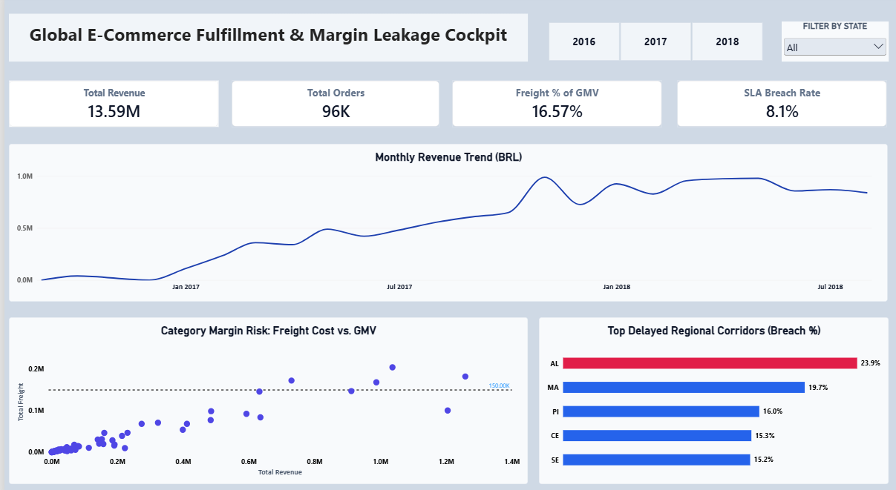

# Olist E-Commerce Analytics: Supply Chain & Margin Leakage Cockpit

## Project Overview:

This end-to-end data analytics project analyzes **13.59M BRL in Gross Merchandise Volume (GMV)** across **96K delivered orders** for Olist, a Brazilian e-commerce platform (2016–2018). The goal was to identify supply chain bottlenecks causing delayed deliveries and pinpoint specific product categories negatively impacting profit margins due to disproportionate freight costs.

---

## Key Metrics at a Glance:

| Metric | Value | Business Focus |
| :--- | :--- | :--- |
| **Analyzed GMV** | 13.59M BRL | 96K Delivered Orders (2016–2018) |
| **Peak Monthly GMV** | >1.0M BRL | Strong demand trajectory |
| **National SLA Breach Rate** | 8.1% | Baseline delivery benchmark |
| **Worst Regional SLA Breach** | 23.9% (Alagoas) / 19.7% (Maranhão) | Northeast corridor bottlenecks |
| **Avg Freight-to-GMV Ratio** | 16.57% | Margin leakage on high-cube items (>25%) |

---

## Key Findings & Business Impact:

* **Revenue Scale & Demand:** The platform demonstrated significant, sustained revenue growth from early 2017 through mid-2018, peaking at over **1M BRL monthly**. This proves strong market demand that is currently being bottlenecked by regional logistics challenges.
* **National vs. Regional Logistics Bottlenecks:** Quantified a baseline **8.1% national delivery SLA breach rate**. However, isolated last-mile bottlenecks in the Northeast corridor—led by Alagoas (AL at **23.9%**) and Maranhão (MA at **19.7%**)—exhibit delay rates nearly triple the national average.  
  * *Recommendation:* Critically re-evaluate carrier contracts or establish closer distribution centers for this region.
* **First-Mile Seller Latency:** Identified critical first-mile delays where specific seller hubs generated late carrier handoffs past the designated shipping limit date on **over 15% of dispatches**.
* **Margin Leakage via Freight Absorption:** Uncovered that logistics costs average **16.57% of GMV** overall. Scatter plot analysis revealed specific low-ticket, high-cube product categories experiencing freight expenses **>25% of item value**.  
  * *Recommendation:* These specific "margin leakers" are significantly eroding marketplace take-rates and require immediate pricing restructuring or specialized shipping strategies.

---

## Tools & Pipeline:

* **Python (Pandas):** Extracted and cleaned over 100,000 raw e-commerce records, handling missing values and formatting dates.
* **MySQL:** Loaded the cleaned data into a relational database and executed complex queries to calculate delivery times, SLA breach rates, and margin metrics.
* **Power BI:** Engineered an interactive dashboard utilizing custom DAX measures to visualize key performance indicators for executive stakeholders.

---

## Dashboard Preview:



---

## Repository Structure:

```text
├── Exported_Results_from_MYSQL/              # Query outputs exported from MySQL analysis
├── SQL_Codes_for_ExportedResults_from_MYSQL/ # SQL scripts (SLA breach, margin leakage, handoffs)
├── Global_Ecommerce_project_PY-To-SQL.ipynb   # Python ETL & database load notebook
├── Global_Ecommerce_SupplyChain_DASHBOARD.pbix# Interactive Power BI dashboard file
├── dashboard_preview.png                     # Dashboard snapshot
└── README.md                                 # Project documentation
